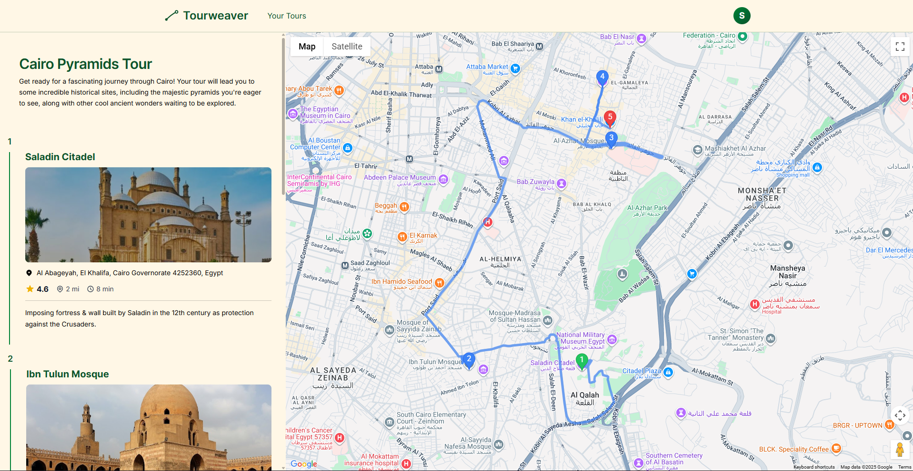
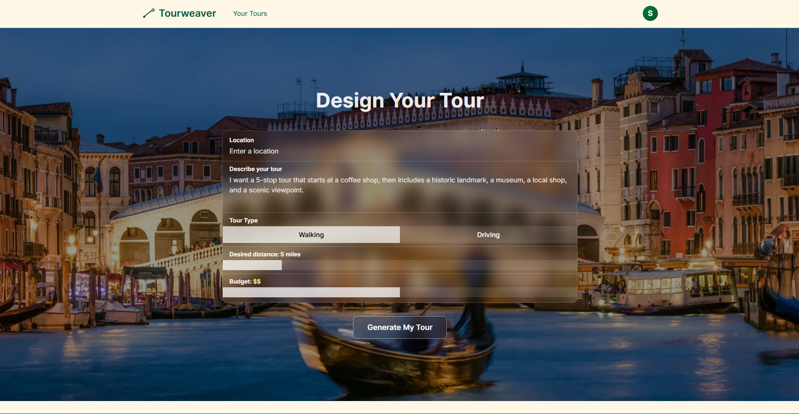
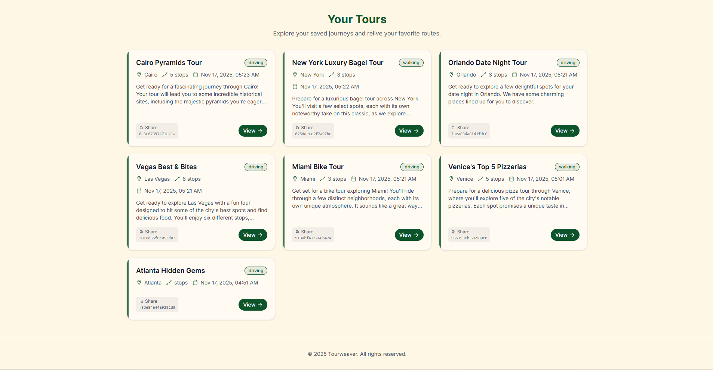

# Tourweaver

A tour-planning platform that uses a custom Gemini-powered agent integrated with Google Places and Google Maps to generate tailored, location-aware itineraries from a user’s natural-language request.

The platform is built with a **Next.js + Tailwind** frontend (deployed on Vercel), a **Node/Express** backend, a **PostgreSQL** database, and **Firebase Authentication**.  
Tourweaver runs a multi-step agent pipeline which interacts with the **Google Places API** and **Google Maps** to recommend destinations and generate optimized routes.

---

## Screenshots

  <strong>Generated Tour</strong> 
  

 

  <table>
    <tr>
      <td align="center">
        <strong>Design a Tour</strong> 
        
      </td>
      <td align="center">
        <strong>Tour History</strong> 
        
      </td>
    </tr>
  </table>

---

## Features

- **AI-Generated Tours**
  - Users describe what they want in natural language  
  - A custom agent pipeline (powered by Gemini + Google Places) selects relevant, high-quality stops  
  - The itinerary is generated **in a meaningful order**, not just a list of places  

- **Location Intelligence**
  - Each stop is sourced using real Google Places data  
  - Ensures relevance, accuracy, and up-to-date location information  

- **Route Navigation**
  - Navigation between stops is handled through the **Google Maps API**  
  - Provides routing, directions, and map-based visualization  

- **Sharable Tour Links**
  - Each generated tour can be accessed through a unique, shareable link  

- **Reliable Backend**
  - Asynchronous API with a non-blocking, user-friendly loading experience  
  - All tours and stops are stored in PostgreSQL  
  - API powered by Express and Node.js  

- **Authentication**
  - Firebase login via Google 
  - Secure access to user-specific tours  

---

## Tech Stack

- **Frontend:** Next.js (React), Tailwind CSS, deployed on Vercel  
- **Backend:** Node.js, Express  
- **Database:** PostgreSQL  
- **Auth:** Firebase Authentication  
- **AI/Agent System:** Gemini (custom agent integration)  
- **External APIs:** Google Places API, Google Maps  
- **Infrastructure:**  
  - Hosted on DigitalOcean  
  - Dockerized backend and database  
  - Nginx reverse proxy  
  - RESTful JSON APIs  